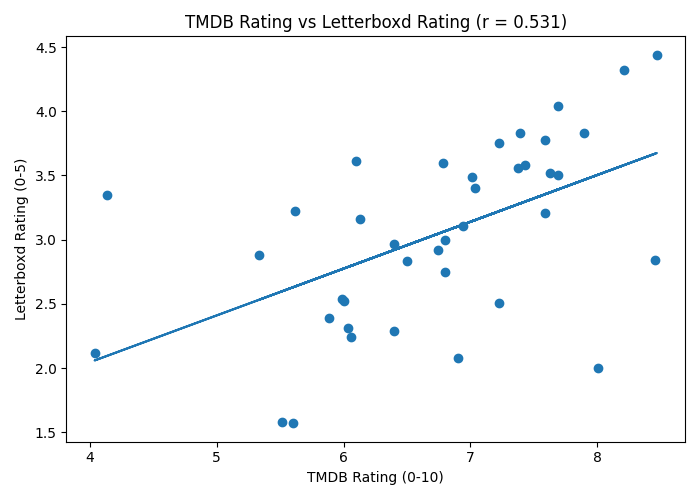
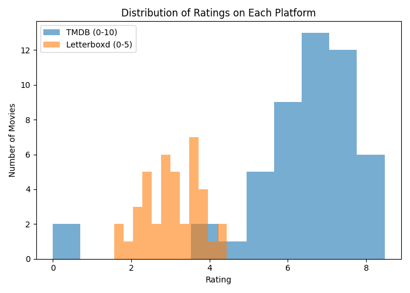
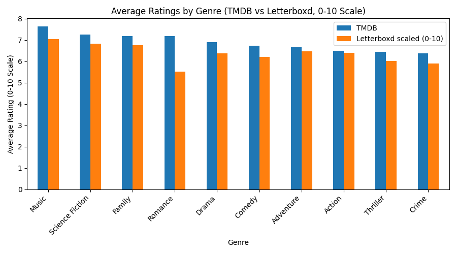
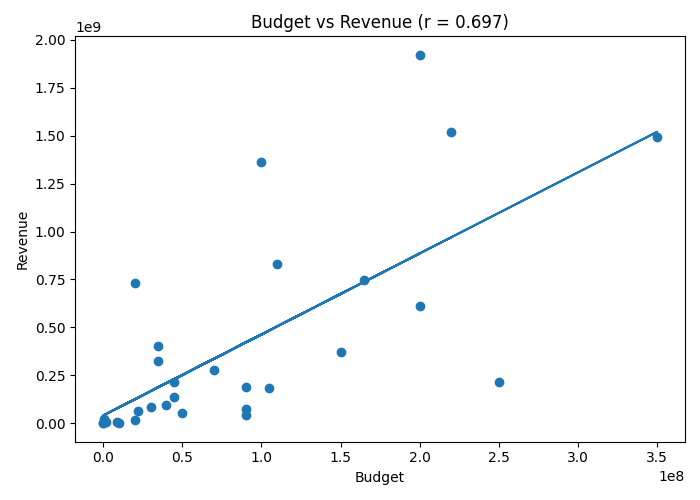

# Report: Movie Data Collection and Analysis

## Data Collection Summary

This project collected movie data from two primary sources:

- **TMDB API**: Provided structured data including movie titles, release dates, ratings, genres, budget, and revenue.
- **Letterboxd (web scraping)**: Provided user-generated ratings and engagement data.

A total of **50 movies** were collected from TMDB. After cleaning and merging:

- **39 out of 50 movies** had both TMDB and Letterboxd ratings available
- **30 movies** had valid budget and revenue data

The datasets were merged using movie title and release year. Some data loss occurred due to mismatches between TMDB titles and Letterboxd URLs.

---

## Analysis Findings

### 1. Rating Analysis

The correlation between TMDB and Letterboxd ratings is:

- **Correlation (r): 0.531**

This indicates a **moderate positive relationship**, suggesting that movies rated highly on one platform tend to also receive higher ratings on the other, although the relationship is not perfectly linear.

- Average TMDB rating: **6.41**
- Average Letterboxd rating: **3.04**

Since TMDB uses a 0–10 scale and Letterboxd uses a 0–5 scale, direct comparisons require careful interpretation.

The distribution of ratings shows that most movies fall within mid-to-high rating ranges on both platforms.

---

### 2. Genre Analysis

#### Most Common Genres

The most frequent genres in the dataset are:

- Adventure (16)
- Action (15)
- Thriller (13)
- Comedy (13)
- Horror (13)

This reflects the dominance of mainstream and blockbuster-oriented genres in the sample.

#### Average Ratings by Genre

Genres with the highest average ratings include:

- Music  
- Science Fiction  
- Family  
- Romance  

Notably, **Music** has the highest average rating among all genres. This is an interesting result, as it is not among the most common genres in the dataset. This suggests that less frequent genres may receive stronger audience appreciation or be more critically favored.

---

### 3. Financial Analysis

The relationship between budget and revenue shows:

- **Correlation (r): 0.697**

This indicates a **strong positive relationship**, meaning that higher-budget movies generally generate higher revenue.

#### Most Profitable Movies

Examples of the most profitable movies include:

- *Spider-Man: No Way Home*  
- *The Avengers*  
- *The Super Mario Bros. Movie*  

These films generated substantial profits, far exceeding their production budgets.

---

## Interesting Insights

- The correlation between TMDB and Letterboxd ratings (r = 0.531) is moderate rather than strong, suggesting that while the two platforms generally agree, they capture different audience perspectives. TMDB ratings likely reflect a broader audience, whereas Letterboxd users may be more selective or film-oriented.

- There is a noticeable difference in rating scale and distribution: TMDB ratings are more compressed within a narrower range (typically 6–8), while Letterboxd ratings show greater variation relative to its scale. This may indicate differences in rating behavior between platforms.

- Although genres such as Action and Adventure are the most common, they do not have the highest average ratings. Instead, **Music** emerges as the highest-rated genre despite appearing less frequently. This suggests that niche or less mainstream genres may receive stronger critical or audience appreciation.

- The strong correlation between budget and revenue (r = 0.697) confirms that higher-budget films tend to generate higher revenue. However, the variability in profit indicates that high investment does not always guarantee proportional returns.

- The dataset highlights a potential selection bias: popular or blockbuster films dominate the sample, which may influence both genre frequency and rating distributions. This suggests that expanding the dataset could reveal different patterns.

- Minor inconsistencies between TMDB and Letterboxd ratings may also reflect differences in user demographics, rating culture, and the timing of ratings (e.g., newer films may have less stable ratings).

---

## Challenges Encountered and Solutions

### 1. Letterboxd URL mismatches

A key challenge was matching TMDB movie titles to the correct Letterboxd pages. Letterboxd URLs require precise slug formatting, which does not always align with TMDB titles.

For example:
- The movie **"Lee Cronin's The Mummy"** initially produced the slug  
  `lee-cronin-s-the-mummy`, which resulted in a 404 error.
- Adjusting the slug to  
  `lee-cronins-the-mummy`  
  successfully resolved the issue.

This demonstrates that simple automated slug generation is not always sufficient.

**Solution:**
- Implemented a slug conversion function
- Manually adjusted problematic cases when necessary
- Allowed failed scrapes to be handled gracefully without interrupting the pipeline

---

### 2. Incomplete data coverage

Not all movies had complete data across both sources:

- Only **39 out of 50 movies** had both TMDB and Letterboxd ratings
- Only **30 movies** had valid budget and revenue data

**Solution:**
- Filtered datasets based on available data for each analysis task
- Reported sample sizes explicitly to maintain transparency

---

### 3. Data quality issues

Some observations contained invalid or misleading values (e.g., TMDB rating = 0), likely due to missing or insufficient data.

**Solution:**
- Treated such cases as outliers and removed them before analysis
- Ensured that computed correlations were not distorted by invalid values

---

## Limitations and Future Improvements

### Limitations

- Title-based matching may introduce inaccuracies when scraping Letterboxd
- Some movies lack complete financial or rating data
- The relatively small dataset (~50 movies) limits statistical generalization

### Future Improvements

- Use more robust matching techniques (e.g., fuzzy matching or unique identifiers)
- Expand the dataset to include a larger and more diverse set of movies
- Incorporate additional features such as user reviews or popularity metrics
- Extend the analysis to include temporal trends (e.g., ratings over time)

---

## Conclusion

This project demonstrates the construction of a full data pipeline integrating API-based data collection and web scraping. The analysis reveals meaningful relationships between movie ratings, genres, and financial performance, while also highlighting the practical challenges of working with real-world data.